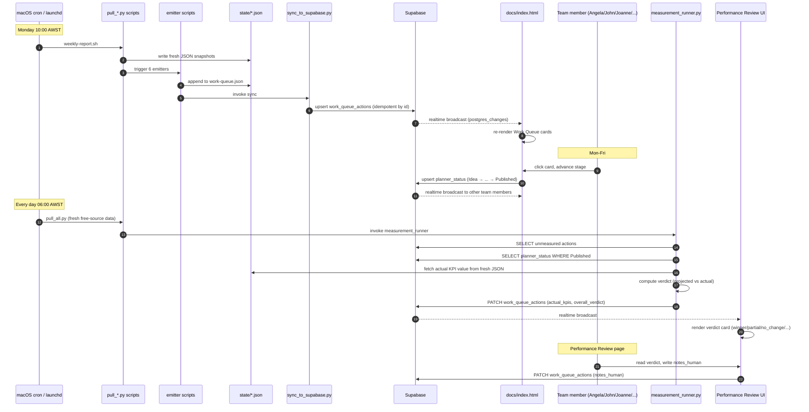

# CB_Marketing — Engineering Reference

This is the architecture document for human engineers extending or
maintaining the system. For operational instructions (running, restarting,
debugging), see `HANDOFF.md`. For tactical content workflow, see
`context/team-roster.md`.

---

## What this system is, in one sentence

A weekly marketing automation pipeline that turns raw data (Google
Analytics, Search Console, Ads platforms, CRM, scraped competitor intel)
into typed, owner-attributed, KPI-projected action recommendations — then
measures whether the team's execution actually moved the projected metric.

---

## The 4 layers (read this first)

```
┌─────────────────────────────────────────────────────────────────────┐
│  LAYER 1 — DATA PIPELINE  (Python scripts, cron-driven)              │
│  pull_*.py → state/*.json                                            │
│  Pulls from external APIs. Pure I/O, no business logic.              │
└─────────────────────────────────────────────────────────────────────┘
                                  │
                                  ▼
┌─────────────────────────────────────────────────────────────────────┐
│  LAYER 2 — SKILLS  (Markdown rulebooks, auto-activated)              │
│  skills/*/SKILL.md (37 of them)                                      │
│  Each is a how-to for one content type. Triggered by keywords.       │
│  No code — just structured prose.                                    │
└─────────────────────────────────────────────────────────────────────┘
                                  │
                                  ▼
┌─────────────────────────────────────────────────────────────────────┐
│  LAYER 3 — AGENTS  (YAML configs, LLM-powered)                       │
│  agents/*.yml (9 of them)                                            │
│  Compose skills + tools + context. Produce strategic narratives.     │
│  Output: outputs/*/*.md                                              │
└─────────────────────────────────────────────────────────────────────┘
                                  │
                                  ▼
┌─────────────────────────────────────────────────────────────────────┐
│  LAYER 4 — WORK QUEUE  (Python emitters, rule-based)                 │
│  scripts/work_queue/*_emitter.py (6 of them)                         │
│  Read state/*.json, apply decision rules, emit typed actions.        │
│  Output: state/work-queue.json → Supabase → dashboard cards          │
└─────────────────────────────────────────────────────────────────────┘
                                  │
                                  ▼
┌─────────────────────────────────────────────────────────────────────┐
│  PRESENTATION — DASHBOARD  (single-file HTML + Supabase realtime)    │
│  docs/index.html (~13K lines) + cbState namespace                    │
│  Reads from work_queue_actions table, renders cards, accepts edits.  │
└─────────────────────────────────────────────────────────────────────┘
```

**Critical design choice:** Layers 3 (Agents) and 4 (Emitters) coexist
intentionally. Agents are for **strategic narrative** (the WHY); emitters
are for **tactical to-dos** (the WHAT). The two were rescoped in Sessions
5b-5h to eliminate overlap — see `CB_Brain/wiki/Work-Queue-Architecture.md`
for the decision history.

---

## Folder map

```
CB_Marketing/
├── HANDOFF.md                    Operator runbook (read first)
├── ENGINEERING.md                This file
├── README.md                     Quick start
├── CLAUDE.md                     Instructions for the Claude AI
├── .env                          API keys (gitignored)
├── secrets/                      Google service-account JSONs (gitignored)
├── .venv/                        Python virtualenv
│
├── scripts/                      Layer 1 + Layer 4 — all Python
│   ├── pull_*.py                 Data extractors (one per source)
│   ├── pull_all.py               Orchestrates free-source pulls
│   ├── pull_weekly.py            Orchestrates paid-source pulls
│   ├── parse_*.py                Format-specific parsers (XLSX, PDF)
│   ├── inject-*.py               Refresh inline data in docs/index.html
│   ├── bake-*.py                 HTML report generators
│   ├── weekly-report.sh          Monday 10am pipeline orchestrator
│   ├── deploy-dashboard.sh       git push → GitHub Pages
│   └── work_queue/               Layer 4 emitters + measurement
│       ├── schema.py             WorkQueueAction dataclass
│       ├── baselines.py          Pre-computed KPI baselines per source
│       ├── measurement.py        Pure verdict logic (no I/O)
│       ├── measurement_runner.py Daily verdict resolver
│       ├── sync_to_supabase.py   JSON → Supabase upsert
│       ├── seo_emitter.py        SEO archetypes (OPTIMISE/BUILD/PROTECT)
│       ├── meta_emitter.py       Meta archetypes (PAUSE/SCALE/REFRESH)
│       ├── google_ads_emitter.py Google archetypes (PAUSE/SCALE/OPTIMISE)
│       ├── gbp_emitter.py        GBP archetypes (REVIEW/PHOTO/COMPETITOR_GAP)
│       ├── social_emitter.py     Social archetypes (TREND_RIDE/CREATIVE_INSPO)
│       └── membership_emitter.py Membership archetypes (SAVE_CALL/CHURN/SWITCH/ADDON)
│
├── agents/                       Layer 3 — LLM agents
│   └── *.yml                     One YAML per agent (9 total)
│
├── skills/                       Layer 2 — auto-activated rulebooks
│   └── */SKILL.md                One Markdown file per skill (37 total)
│   └── manifest.json             Trigger keyword → skill mapping
│
├── context/                      System reference data
│   ├── brand-voice.md            Brand rules
│   ├── team-roster.md            Who owns what (source of truth)
│   ├── seasonal-calendar.md      Campaign timing
│   ├── seo-*.md / *.json         SEO targets and priorities
│   └── *.json                    Compressed reference data fed to agents
│
├── state/                        Live data — never committed
│   ├── *-data.json               Per-source snapshots (ga4, gsc, gbp, ...)
│   ├── work-queue.json           Emitter output (synced to Supabase)
│   ├── last-refresh.json         Cron status
│   └── .baker-disabled           Sentinel — see "gotchas" section
│
├── outputs/                      Agent + report outputs
│   ├── research/                 Performance + competitor + audience reports
│   ├── seo/                      SEO audits + briefs
│   ├── content/                  Social posts + reels + emails
│   ├── blueprints/               Campaign blueprints
│   ├── creatives/                Ad copy + creative briefs
│   └── reports/                  HTML executive reports (Monday email)
│
├── docs/                         Static site — deployed to GitHub Pages
│   ├── index.html                The dashboard (single file, ~13K lines)
│   ├── briefs/                   Per-campaign HTML briefs
│   └── mockups/                  Design prototypes
│
├── db/                           Supabase schema + RLS
│   ├── schema.sql                DDL for all tables
│   └── policies.sql              RLS policies
│
└── logs/                         Cron + agent runtime logs
```

---

## Sequence diagram: the closed loop



This is the heart of the system. Every other moving part exists to support
this loop.

---

## Layer-by-layer detail

### Layer 1 — Data Pipeline

**Pattern:** each `pull_*.py` is a single-purpose script that:
1. Reads credentials from `.env` (loaded by parent shell)
2. Calls one external API
3. Normalises the response into a flat JSON structure
4. Writes to `state/<source>-data.json`

**Cadence:**
- **Daily (06:00 AWST via launchd `com.cb247.data-refresh`):**
  `pull_ga4.py`, `pull_gsc.py`, `pull_gbp.py` (free APIs)
- **Weekly (Monday 10:00 AWST via cron `weekly-report.sh`):**
  `pull_google_ads.py`, `pull_meta.py`, `pull_ahrefs.py`,
  `pull_apify.py`, `run_screaming_frog.py`,
  `parse_metricool_pdf.py`, `parse_membership_data.py`

**Cost rationale:** free APIs refresh daily (small price for fresh
dashboard). Paid/rate-limited sources stay weekly (Ahrefs unit budget,
Google Ads basic-access quota, Apify pay-per-event, Meta rate limits).

**Reliability tactics:**
- Each `pull_*.py` is independent. One failing doesn't block others.
- Errors are logged, not raised. `pull_all.py` captures per-source
  status into `state/last-refresh.json`.
- The c-ares DNS bug on macOS is worked around by setting
  `GRPC_DNS_RESOLVER=native` in the launchd plist.

### Layer 2 — Skills

**Pattern:** Markdown documents in `skills/<name>/SKILL.md` that codify
"how to write a [content-type]". They contain formulas, templates,
quality checklists, and brand-voice rules.

**Activation:** Skills auto-load when Claude sees specific trigger
keywords in a request. Mapping lives in `skills/manifest.json`.

Skills are NOT executed code. They are CONTEXT for Claude. The agent
or human task picks the relevant skill, loads its SKILL.md, then follows
the rules.

**Examples:**
- `seo-landing-page-writer` activates on "landing page", "build page"
- `email-funnel-builder` activates on "write email", "email sequence"
- `report-formatter` activates via PostToolUse hook on any `outputs/*.md`
  write — produces a McKinsey-style executive version

### Layer 3 — Agents

**Pattern:** YAML configurations in `agents/<name>.yml` that compose:
- A `data_source` (one `context/*.json` curated brief — NOT raw `state/`)
- A list of `skills` it can invoke
- A list of `tools` it has access to (Read paths, Write paths, WebFetch)
- A workflow of named steps with skill invocations and output paths

**Critical boundary:** agents read from `context/` (compressed, curated
data), NOT from `state/` (raw API output). This caps the agent's input
token budget and forces a clean separation between live data and the
agent's worldview.

**Exception:** the `seo-agent` was granted `Read(state/work-queue.json)`
in Session 5h so it could read the emitter's output as input. This is
the ONE place the agent layer touches the work-queue layer.

**Outputs:** every agent writes one or more `.md` files into `outputs/`.
These are read by humans (Tia + team), not by other systems. They are
narrative — the WHY, the strategic context, the bigger picture.

### Layer 4 — Work Queue (Emitters)

**Pattern:** each `<source>_emitter.py` is a pure-Python script (no LLM)
that:
1. Reads its source data from `state/<source>-data.json`
2. Applies hard-coded rules to classify rows into 3-4 archetypes
3. For each archetype match, instantiates a `WorkQueueAction` dataclass
4. Validates the action (every action must declare at least one
   `ProjectedKPI` with baseline + target + measurement window)
5. Appends to `state/work-queue.json`

**Why rule-based not LLM:**
- Deterministic — same input always produces same output
- Cheap — runs in <1s, no token cost
- Inspectable — thresholds are constants you can read in the source
- Stable — no model regression risk

The downside is that thresholds need to be retuned as the business
grows. For example: SEO emitter's `OPTIMISE_MIN_IMPRESSIONS=1` is sized
for CB247's current low organic volume. Should be raised when traffic
grows.

**Archetype design language varies per source:**

| Source | Archetypes | Verbs match |
|---|---|---|
| SEO | OPTIMISE / BUILD / PROTECT | Organic SEO ops |
| Meta | PAUSE / SCALE / REFRESH | Creative-driven |
| Google Ads | PAUSE / SCALE / OPTIMISE | Intent-driven |
| GBP | REVIEW_GROWTH / PHOTO_REFRESH / COMPETITOR_GAP | Local profile mgmt |
| Social | TREND_RIDE / CREATIVE_INSPO | Opportunity-driven |
| Membership | SAVE_CALL / CHURN_REASON / SWITCH_DEFENCE / ADDON_UPSELL | Revenue ops |

Forcing uniform vocabulary across channels would hurt clarity. Each
verb set matches how the team actually thinks about that channel.

### Measurement runner

Located in `scripts/work_queue/measurement_runner.py`. Runs every 6
hours via `pull_all.py` invocation.

**Algorithm:**
1. Fetch all `work_queue_actions` rows where `actual_kpis IS NULL`
2. For each, fetch the matching `planner_status` row
3. Skip unless `status='Published'` AND elapsed days ≥ max
   `measurement_window_days` across that action's KPIs
4. For eligible actions, for each projected KPI:
   - Look up the actual value via dispatcher in `_fetch_actual()`
     (baseline helpers in `baselines.py`)
   - Compute status (winner / partial_win / no_change / underperforming
     / pending) via `compute_kpi_status()` in `measurement.py`
5. Compute overall verdict via `compute_overall_verdict()`
6. PATCH the Supabase row with `actual_kpis`, `overall_verdict`,
   `measured_at`

**Special case — qualitative actions:** organic-social actions use
`metric: qualitative_assessment` because no automated lookup exists for
organic engagement. These resolve to `status: pending`, and the team
picks the real verdict via the picker UI on Performance Review.

---

## Frontend architecture (docs/index.html)

A single ~13K-line HTML file. NOT a SPA, NOT a framework. Pure HTML +
CSS + vanilla JS.

**Why:**
- Deploys to GitHub Pages with zero build step
- No npm dependencies to maintain
- One file = one git diff per change
- Loads instantly (no JS framework boot)

**Cost:**
- Awkward to navigate (use grep + Read with offset)
- All render functions share a global namespace
- CSS is largely inline — pull out only when needed

### Page structure

The file follows this order:
1. `<head>` with embedded `<style>` (lines 1-450 or so)
2. `<body>` with navigation sidebar, identity bar, page divs
3. `<script>` blocks injected by `inject-*.py` (live data payloads)
4. Inline `<script>` with all rendering logic
5. `cbState` namespace at the bottom

### cbState namespace

Wraps Supabase client + sync layers. Three layers:
- `cbState.planner` — mirrors planner_status + planner_approval
  between localStorage (read cache) and Supabase (source of truth)
- `cbState.workQueue` — mirrors work_queue_actions
- Generic helpers `upsert(table, row)`, `readAll(table)`,
  `subscribe(table, callback)`

Every render function checks `cbState.workQueue.getAll()` and
re-renders when realtime broadcasts arrive.

### Render functions

One per page. Naming pattern: `render<PageName>()`.

```
renderDashboard()         → page-dashboard
renderSEO()               → page-seo
renderGoogleAds()         → page-google-ads
renderMetaAds()           → page-meta-ads
renderOrganicSocial()     → page-organic-social
renderGBP()               → page-gbp
renderMembership()        → page-cb247-membership
renderPlanner()           → page-content-planner (Work Queue)
renderContentReview()     → page-content-review (Performance Review)
renderHowItWorks()        → page-how-it-works
```

Tab switching is handled by `nav(element)` — shows the target
`.page` div and hides others. No router.

### Realtime sync pattern

```javascript
cbState.workQueue.init() {
  // 1. Hydrate from localStorage cache (instant render)
  // 2. Async fetch from Supabase (overwrites cache with fresh data)
  // 3. Subscribe to postgres_changes events
  // 4. Re-render on every event
}
```

When a team member in Browser A changes a card status:
1. UI calls `cbState.planner.setStatus(id, 'In Progress')`
2. This UPDATES planner_status in Supabase
3. Supabase broadcasts the change
4. Browser B's subscription handler fires `renderPlanner()`
5. Card moves columns in Browser B within ~1 second

---

## Database schema (high level)

Three tables in Supabase. Full DDL in `db/schema.sql`.

```
planner_status
  item_id PRIMARY KEY     The action or content item id
  status                  Idea / In Progress / Angela QC / Denver Approval / Scheduled / Published
  updated_by              Identity from "Who am I?" picker
  updated_at              Auto-timestamp on update

planner_approval
  item_id PRIMARY KEY     Same item id space as planner_status
  decision                approved / adjusted / rejected / pending
  notes                   Free text
  updated_by, updated_at  Audit trail

work_queue_actions
  id PRIMARY KEY          e.g. seo-act-2026w23-001
  source_page             seo-organic / meta-ads / google-ads / gbp / organic-social / membership
  source_run_at           ISO timestamp from the emitter run
  title                   Card title
  description             Full body
  owner                   Team member name
  owner_role              Their role
  priority                P1 / P2 / P3
  effort_hours            Numeric
  category                seo / meta / google-ads / gbp / organic-social / membership
  data_quality            high / medium / low
  projected_kpis          JSONB array
  urgent                  boolean
  related_actions         JSONB array
  actual_kpis             JSONB array (NULL until measured)
  overall_verdict         winner / partial_win / no_change / underperforming / pending
  measured_at             ISO timestamp
  notes_human             Team learnings
  updated_at              Auto-timestamp
```

All three tables have RLS enabled. Anon role granted SELECT + INSERT +
UPDATE + DELETE for the dashboard's client-side flow. The publishable
key is intentionally embedded in `docs/index.html` because it's anon-
scoped and protected by RLS.

All three tables have `REPLICA IDENTITY FULL` so realtime broadcasts
include full row data (required for postgres_changes).

---

## Key abstractions worth knowing

### WorkQueueAction (Python dataclass)

`scripts/work_queue/schema.py`. Defines the contract every emitter
must produce. Strict — every action requires at least one ProjectedKPI,
which itself requires either a target OR (delta_min + delta_max).

### ProjectedKPI

Same file. Carries:
- `metric` — one of VALID_METRICS (e.g. `gsc_position`, `meta_ctr`)
- `keyword` or `keyword_pattern` — scope (e.g. specific keyword or
  campaign name)
- `baseline` — current value
- `target` — desired value
- `measurement_window_days` — 1 / 7 / 14 / 28 typical
- `confidence` — high / medium / low

### Baseline dispatcher

`scripts/work_queue/baselines.py`. For every metric in VALID_METRICS,
provides a function that resolves the current value from the appropriate
`state/*.json` file. Used by emitters (for pre-computing baselines) and
by measurement_runner (for fetching actuals).

### Stage colour vocabulary (UI)

Single visual language across the Work Queue calendar AND backlog:

```
IDEA       — opacity 0.5, dashed border       (needs Tia review)
IN PROGRESS — grey left border                (someone working on it)
ANGELA QC  — amber background + border        (brand check pending)
DENVER     — light red background + border    (COO sign-off pending)
SCHEDULED  — bright teal border + shadow      (approved + queued)
PUBLISHED  — solid teal fill, white text      (done — flows to Performance Review)
```

Same vocabulary on Performance Review verdict cards (different mapping —
winner uses teal background, underperforming uses red, etc.).

---

## Tech debt + gotchas

### High priority (worth fixing soon)

1. **`docs/index.html` is 13K+ lines.** Hard to navigate. Splitting it
   into modules would require introducing a build step (Vite or
   similar) which adds a new dependency tier. Defer until the file
   becomes truly unmanageable. Mitigation today: use grep + Read with
   offset, never re-read the whole file.

2. **No automated tests.** Marketing ops, not software. We do
   spot-checks on emitter output and use `--dry-run` flag on
   measurement_runner to validate dispatch shapes. Add tests if/when
   we introduce a second team member who modifies emitter logic.

3. **gRPC DNS resolver fix in launchd plist only.** If you ever run
   `pull_all.py` from a fresh shell, you'll hit c-ares DNS errors.
   The launchd plist sets `GRPC_DNS_RESOLVER=native`. Add the same to
   your shell rc or to `weekly-report.sh` if running directly.

### Medium priority

4. **PLANNER_ITEMS hardcoded in HTML.** The 14 content items live in
   `const PLANNER_ITEMS = [...]` directly in `docs/index.html`. Should
   move to a JSON file + load dynamically. Then content can be edited
   without redeploying.

5. **Calendar item.day is relative to today.** When the team navigates
   to a future week, items at `day=24` won't appear until they roll
   into the 14-day window. Should switch to absolute dates.

6. **No cross-cycle learnings persistence.** Verdicts are written but
   the team's `notes_human` on past actions is never re-surfaced when
   the next cycle's emitters run. Would require a "learning bank" pass
   in each emitter — read past notes for similar archetypes, weight
   thresholds accordingly. Future session.

### Low priority

7. **Sidebar badges removed but render functions still try to set
   them.** `if($('tracker-badge'))` guards prevent errors but the dead
   code path is noise. Clean up next refactor.

8. **`_actionToWorkItem` (legacy converter) still in
   docs/index.html.** Used as fallback when Supabase is empty. Could
   be deleted once we trust Supabase as sole source of truth.

---

## Adding a new emitter (cookbook)

If a new source goes live (e.g., email marketing platform), follow this
recipe:

1. **Pull script.** `scripts/pull_<source>.py` writes
   `state/<source>-data.json`.
2. **Schema extension.** In `schema.py`, add new metrics to
   `VALID_METRICS`.
3. **Direction sets.** In `measurement.py`, add metrics to
   `HIGHER_IS_BETTER` or `LOWER_IS_BETTER`. Add tolerance values to
   `_tolerance_for()`.
4. **Baseline helpers.** In `baselines.py`, add lookup functions for
   each metric. Naming pattern: `<source>_<scope>_metric_for(scope,
   field)`.
5. **Measurement dispatch.** In `measurement_runner.py`, extend
   `_fetch_actual()` to route the new metrics to your helpers.
6. **Emitter.** Create `scripts/work_queue/<source>_emitter.py`.
   Follow the template of any existing emitter — main loop +
   3-4 archetype emitters + `merge_with_existing()` +
   `main()` validation block.
7. **Wire into weekly-report.sh.** Add `Step 1h''''''` (or whatever)
   that invokes the new emitter after the existing ones.
8. **Update HANDOFF.md.** Add the new emitter to the Phase 1 sequence
   table.
9. **Test end-to-end.** Run emitter manually → confirm work-queue.json
   has the new actions → run sync_to_supabase.py → check Supabase row
   → hard-refresh dashboard → confirm cards appear.

---

## Adding a new dashboard page

1. **Sidebar item.** Add `<div class="sidebar-item"
   data-page="<slug>" onclick="nav(this)">Label</div>` in the
   appropriate section.
2. **Page div.** Add `<div class="page" id="page-<slug>"> ... </div>`.
   Include a `<div class="page-header"><h1>Title</h1><p>One-line
   description</p></div>` for consistency with other pages.
3. **Render function.** Add `function render<PageName>() { ... }`.
   Should populate `$('<slug>-content').innerHTML = html`.
4. **Nav hook.** `nav()` automatically calls `render<PageName>()`
   based on the data-page slug. If your slug doesn't follow camelCase
   conversion cleanly, hook it explicitly.
5. **Realtime hook (if needed).** If the page reads from Supabase, add
   the render call to `cbState.<namespace>.setRerenderFn(...)`.

---

## Decision history

The big architectural decisions are captured chronologically in commit
messages and in `CB_Brain/wiki/Work-Queue-Architecture.md`. Key
inflection points:

- **2026-06-06 — Sessions 1-5e:** Built the closed loop. Emitters,
  measurement, verdict picker.
- **2026-06-06 — Session 5h:** Rescoped Performance + SEO agents to
  eliminate overlap with emitters.
- **2026-06-06 — Session 5i-5l:** Simplified UI — Work Queue v2
  (calendar-only), Performance Review v2 (verdict-focused).
- **2026-06-07 — This cleanup pass:** Wrote HANDOFF + ENGINEERING +
  db/schema.

---

**Last updated:** 07 Jun 2026  
**Document owner:** maintained by whoever's currently extending the system
